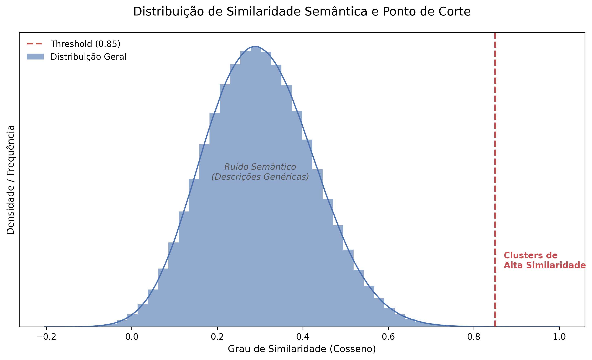

# Criminal Pattern Detection: NLP & Graph Theory


## Visão Geral
Este projeto utiliza **Ciência de Dados Avançada** para identificar conexões ocultas em ocorrências criminais através de dados não estruturados (descrições textuais).

Ao combinar **Processamento de Linguagem Natural (NLP)** com **Teoria dos Grafos**, mapeei a similaridade semântica entre crimes de diferentes cidades e apliquei **Cadeias de Markov** para prever "atratores" de criminalidade na rede, independentemente da localização geográfica.

## Tecnologias Utilizadas
* **Linguagem:** Python
* **NLP:** Sentence-Transformers (BERT models), WordCloud
* **Modelagem de Redes:** NetworkX
* **Estatística:** Cadeias de Markov, Simulação de Monte Carlo
* **Visualização:** Matplotlib, Seaborn

## Metodologia

1. **Engenharia de Dados (Filtro Anti-Boilerplate):** Remoção de descrições genéricas (< 5 palavras) para garantir conexões baseadas em *modus operandi* real.
2. **Vetorização (Embeddings):** Uso do modelo `paraphrase-multilingual-mpnet-base-v2` para transformar texto em vetores.
3. **Grafo de Similaridade:** Conexão de cidades com similaridade de cosseno > 0.7.
4. **Previsão Estocástica:** Cálculo da distribuição estacionária ($\pi$) via Cadeias de Markov.

## Metodologia e Pipeline

### 1. Definição do Limiar Semântico (Threshold)
Para construir a rede, analisei a distribuição de similaridade de cosseno de milhares de pares de ocorrências. Defini um ponto de corte (Threshold = 0.85) para separar o "ruído" (descrições genéricas) dos "padrões fortes".


*(Figura 1: Histograma de densidade demonstrando a separação entre ruído e clusters de alta similaridade)*

### 2. Topologia da Rede Criminal
Após a filtragem, construí um grafo onde cada nó é uma cidade e as arestas representam a força da conexão semântica entre seus crimes.


*(Figura 2: Visualização dos clusters. Note como cidades distantes geograficamente se conectam pela natureza do crime)*

## Resultados

### 1. Identificação de Padrões Semânticos (Hubs)
A análise revelou que os "Hubs" de criminalidade (cidades centrais na rede) compartilham um vocabulário específico de **escalada de violência** (ex: "tiros", "suspeito", "roubo", "armado").


*(Figura 3: Nuvem de palavras gerada a partir das descrições dos principais atratores da rede)*

### 2. Validação Matemática (Monte Carlo)
Para garantir a robustez do modelo, a distribuição teórica (Álgebra Linear / Vetor Estacionário) foi confrontada com uma simulação de Monte Carlo (100.000 passos).
* **Erro Médio Absoluto (MAE):** `0.0001` (Convergência quase perfeita).


*(Figura 4: Comparação entre a probabilidade calculada via Markov (Azul) e a frequência simulada (Laranja))*

## Estrutura do Projeto
```bash
├── data/              # Amostra de dados 
├── images/            # Visualizações geradas
├── notebooks/         # Jupyter Notebook
├── requirements.txt   # Dependências do projeto
└── README.md          # Documentação
```

## Conclusão
O projeto demonstrou que a análise semântica pode revelar estruturas de segurança pública invisíveis a análises puramente geográficas. A validação cruzada confirmou a robustez matemática do modelo preditivo.

Desenvolvido por Amanda Costa


