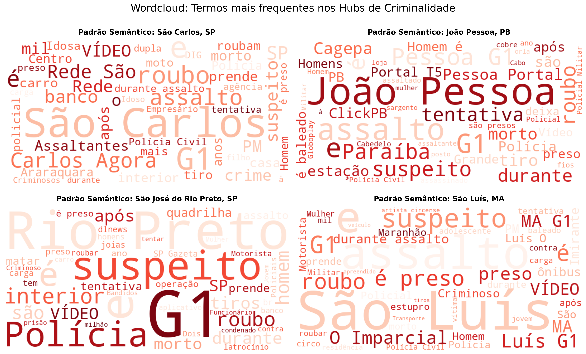
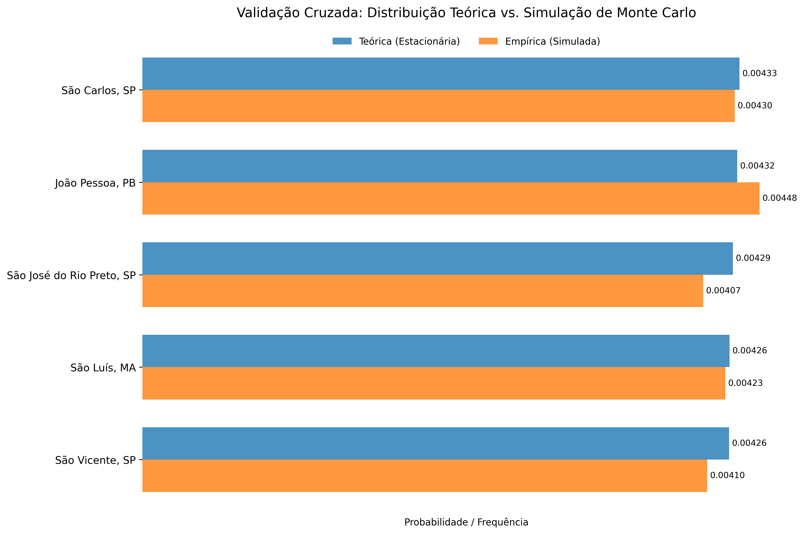

# Criminal Pattern Detection: NLP & Graph Theory


## Visão Geral
Este projeto utiliza **Ciência de Dados Avançada** para identificar conexões ocultas em ocorrências criminais através de dados não estruturados (descrições textuais).

Ao combinar **Processamento de Linguagem Natural (NLP)** com **Teoria dos Grafos**, mapeei a similaridade semântica entre crimes de diferentes cidades e apliquei **Cadeias de Markov** para prever "atratores" de criminalidade na rede, independentemente da localização geográfica.

## Tecnologias Utilizadas
* **Linguagem:** Python
* **NLP:** Sentence-Transformers (BERT models), WordCloud
* **Modelagem de Redes:** NetworkX
* **Estatística:** Cadeias de Markov, Simulação de Monte Carlo
* **Visualização:** Matplotlib, Seaborn

## Metodologia

1. **Engenharia de Dados (Filtro Anti-Boilerplate):** Remoção de descrições genéricas (< 5 palavras) para garantir conexões baseadas em *modus operandi* real.
2. **Vetorização (Embeddings):** Uso do modelo `paraphrase-multilingual-mpnet-base-v2` para transformar texto em vetores.
3. **Grafo de Similaridade:** Conexão de cidades com similaridade de cosseno > 0.7.
4. **Previsão Estocástica:** Cálculo da distribuição estacionária ($\pi$) via Cadeias de Markov.

## Principais Resultados

### 1. Identificação de Padrões Semânticos
A análise revelou que os "Hubs" de criminalidade não são aleatórios. A nuvem de palavras confirma que cidades conectadas compartilham um vocabulário de **escalada de violência** (ex: "tiros", "suspeito", "roubo").


*(Padrão semântico identificado nos principais atratores da rede)*

### 2. Validação Matemática (Monte Carlo)
Para garantir a robustez do modelo, a distribuição teórica (Álgebra Linear) foi confrontada com uma simulação de Monte Carlo (100.000 passos).
* **Erro Médio Absoluto (MAE):** `0.0001` (Convergência quase perfeita).



## Estrutura do Projeto
```bash
├── data/              # Amostra de dados 
├── images/            # Visualizações geradas
├── notebooks/         # Jupyter Notebook
├── requirements.txt   # Dependências do projeto
└── README.md          # Documentação

## Conclusão
O projeto demonstrou que a análise semântica pode revelar estruturas de segurança pública invisíveis a análises puramente geográficas. A validação cruzada confirmou a robustez matemática do modelo preditivo.

Desenvolvido por Amanda Costa


